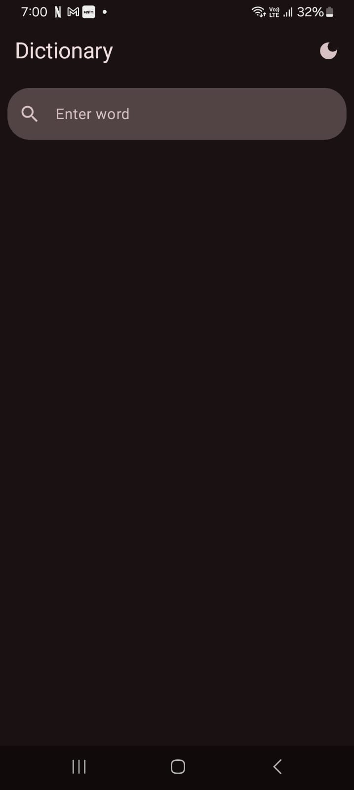
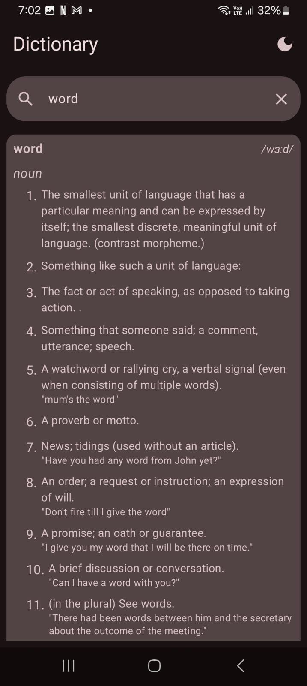
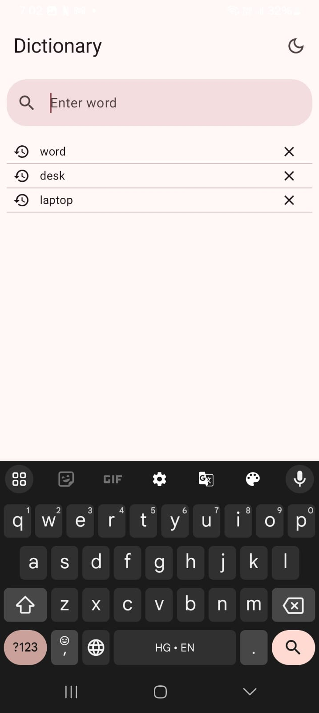
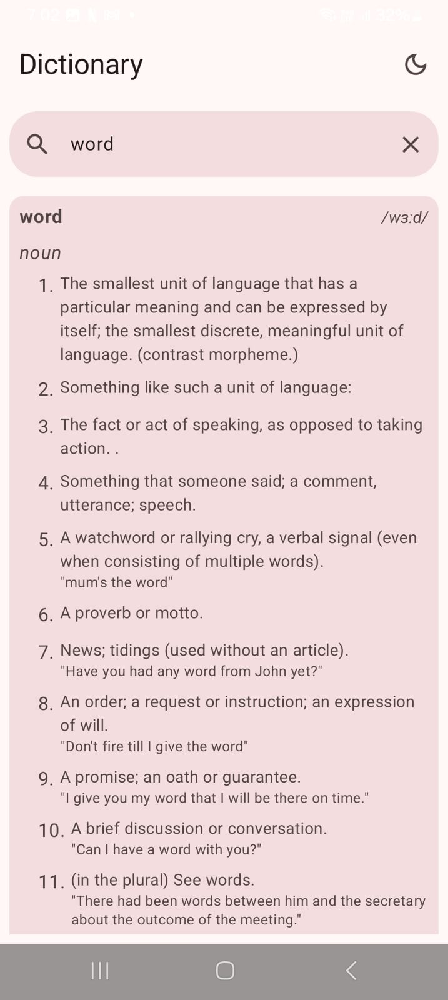

# Dictionary App
Dictionary is a native android app that allows users to search for words and get its meanings, definitions and usages from the Free Dictionary API. 

### Features
* Search for words and view their meanings, definitions, usages.
* The search history is saved locally.
* Persistent light mode/dark mode preference is available.

### Technologies and Libraries Used
* Jetpack Compose
* Free Dictionary API
* Retrofit
* Gson Converter
* Kotlin Coroutines
* Dagger-Hilt
* Room Database
* DataStore Preferences

### Screenshots

### Acknowledgements
<a href = "https://dictionaryapi.dev/">Free Dictionary API</a>
